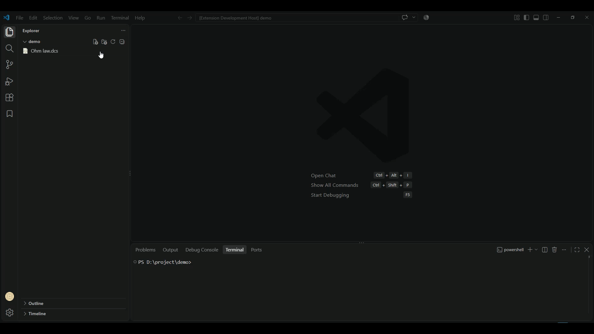

===================================================
DC Operating Point Check with Circuit Validation
===================================================

This guide explains how to validate a circuit's DC Operating Point (OP) and inspect the complete **Process Log** using the DSPICE extension in Visual Studio Code.

Overview
--------

The **OP-Check** feature allows you to perform an instant circuit validation and view raw simulation logs, solver details, nodal voltages, and branch currents directly in an overlay log panel without placing manual probes.

Tutorial Reference
-------------------

Step-by-Step Procedure
----------------------

1. Create a Schematic File
~~~~~~~~~~~~~~~~~~~~~~~~~~
* In the VS Code Explorer, click **New File**.
* Name the file ``operating point.dcs``.

2. Build the Schematic Circuit
~~~~~~~~~~~~~~~~~~~~~~~~~~~~~~~
* Open the **Symbols Library**.
* Drag two **Resistors** (``R1``, ``R2`` = 1kΩ) into the canvas.
* Switch to the **Source** tab and place a **DC Voltage Source** (``V1``).
* Connect the components using wires.
* Place a **Ground** symbol attached to the bottom wire.

3. Modify Source Parameters
~~~~~~~~~~~~~~~~~~~~~~~~~~~~
* Select the voltage source parameter ``dc=10V``.
* In the **Parameter** side panel, change the **Value** from ``10V`` to ``15V``.

4. Run DC Operating Point Check
~~~~~~~~~~~~~~~~~~~~~~~~~~~~~~~~
* Click on an empty space on the canvas to open **Page design** / **Circuit Properties**.
* Locate **OP-Check** under **Circuit Properties** and click **Show**.
* The **DC Operating Point Check** panel will pop up.
* Click the **Check Circuit** button to run validation.

5. Analyze the Process Log
~~~~~~~~~~~~~~~~~~~~~~~~~~
The **PROCESS LOG** window displays complete execution information:

* **Circuit Status**: Verifies that there are no floating nodes or missing references (``Circuit status: OK``).
* **Warnings & Errors**: Displays any detected schematic issues (``No warnings found``).
* **Nodal Voltages & Currents**:
  
  .. code-block:: text

     [00:01:29] v(1) = 7.5
     [00:01:29] v(2) = 15

* **Memory & Performance Metrics**: Shows total analysis time, current application program size, and matrix solver details.

