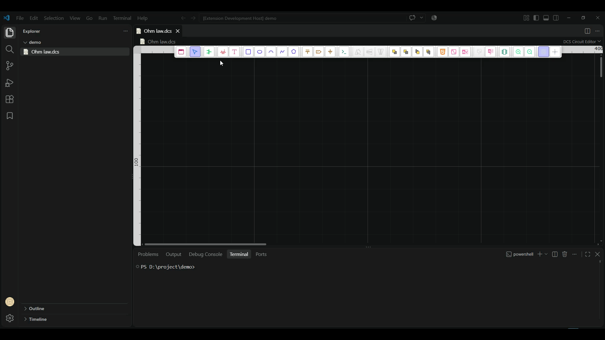

====================================
Operating Point (.OP) Simulation
====================================

This guide explains how to set up, configure, and execute an Operating Point (`.OP`) simulation in Visual Studio Code using the **DSPICE** extension.

Overview
--------

An Operating Point simulation calculates the steady-state DC voltage and current values across all components and nodes in a circuit. DSPICE provides an interactive schematic editor and real-time probe annotations to display these values directly on the canvas.

Step-by-Step Workflow
---------------------

1. Create a Schematic File
~~~~~~~~~~~~~~~~~~~~~~~~~~
* Open Visual Studio Code with the DSPICE extension enabled.
* Create or open a file with the ``.dcs`` extension (e.g., ``Ohm law.dcs``).
* The **DCS Circuit Editor** grid canvas will launch automatically.

2. Place Components from the Symbols Library
~~~~~~~~~~~~~~~~~~~~~~~~~~~~~~~~~~~~~~~~~~~~
* Click the **Symbols Library** icon on the floating toolbar.
* Select **Basic Components** to add a Resistor (``R1``). Click on the canvas to place it, and press ``R`` to rotate if needed.
* Switch to **Source** category in the library, and select **DC Voltage** (``V1``).
* Place the voltage source on the canvas.

3. Wire the Circuit & Place Ground
~~~~~~~~~~~~~~~~~~~~~~~~~~~~~~~~~~
* Click and drag from component terminals to draw connecting wires and form a closed circuit.
* Select the **Ground** tool from the toolbar and attach a ground reference (``GND`` / node 0) to the circuit.

4. Attach Measurement Probes
~~~~~~~~~~~~~~~~~~~~~~~~~~~~
* Click the **Measure Voltage/Current** icon on the toolbar.
* Place probes adjacent to the component or node you wish to measure.
* Click on a probe to open its **Probe Settings** side panel.
* Click **Select Signal**, choose the desired parameter (e.g., ``V(R1)`` for voltage or ``I(R1)`` for current), and confirm with **OK**.

5. Run the Simulation
~~~~~~~~~~~~~~~~~~~~~
* Click the **Run Simulation** button on the top-right of the editor canvas.
* DSPICE runs the simulation and annotates live DC values directly onto the probe labels (e.g., ``V(R1) = 10V``, ``I(R1) = 10.000 mA``).

6. Edit Parameters & Re-run
~~~~~~~~~~~~~~~~~~~~~~~~~~~
* Click on any component parameter (e.g., changing resistance from ``1KΩ`` to ``100Ω``, or voltage from ``10V`` to ``25V``).
* Re-run the simulation to see updated real-time probe outputs.

Troubleshooting
---------------

* **Unassigned Probes**: Ensure each probe is assigned to a specific signal node/branch in the side panel before running the simulation.
* **Ground Required**: The SPICE engine requires node ``0`` (Ground) to establish reference node voltages.