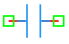

.. _capacitor_element:

Capacitor
=========

The **Capacitor** is a fundamental passive component in the DSpice Basic library, used to model electrical capacitance within analog circuits. It is based on the standard SPICE capacitor model and leverages the ngspice simulation backend for accurate DC, AC, and transient analysis.

Symbol
------

The schematic symbol for the Capacitor follows the IEEE/ANSI standard representation with two parallel plates.

Description
-----------

A capacitor stores electrical energy in an electric field between two conductive plates separated by a dielectric material. In DSpice, the capacitor element is defined primarily by its capacitance value in Farads (F). Key characteristics include:

- **Energy Storage:** Stores charge and releases it when needed, following the relationship Q = C × V.
- **Frequency Dependent:** Impedance decreases with increasing frequency (Z = 1/jωC), making it useful for filtering applications.
- **Passive Component:** Does not require an external power source to function.
- **Transient Behavior:** Voltage across a capacitor cannot change instantaneously, creating time-dependent circuit responses.
- **DC Blocking:** Acts as an open circuit at steady-state DC, blocking DC current while allowing AC signals to pass.

The capacitor is essential for filtering, coupling/decoupling, energy storage, timing circuits, and frequency-selective networks.

Netlist Format
--------------

In the SPICE netlist generated by DSpice, the capacitor is represented using the following syntax:

.. code-block:: text

   C<name> <node+> <node-> <value> [IC=<value>]

Where:

- ``C<name>``: Unique identifier starting with 'C' (e.g., C1, C_FILTER, C_DECOUP).
- ``<node+>``: Positive terminal node number or name.
- ``<node->``: Negative terminal node number or name.
- ``<value>``: Capacitance value in Farads. Suffixes like 'u' (micro), 'n' (nano), 'p' (pico), or 'f' (femto) are supported.
- ``[IC=<value>]``: Optional initial condition specifying the voltage across the capacitor at time t=0 in Volts.

Example:

.. code-block:: text

   C1 1 0 100u
   C_FILTER in out 10n IC=2.5
   C_DECOUP vcc gnd 100n

This format ensures full compatibility with ngspice and allows seamless integration into larger circuit netlists.

Advanced Parameters & Symbol Modification
-----------------------------------------

DSpice supports advanced simulation studies through optional parameters that can be added directly to the component symbol. This feature allows users to customize component behavior without altering the global model library.

Adding Initial Conditions
~~~~~~~~~~~~~~~~~~~~~~~~~

To perform transient analysis with specific starting conditions, you can modify the Capacitor symbol to expose the ``IC`` parameter:

1. **Open Symbol Editor:** Right-click the Capacitor symbol in your schematic and select "Edit Symbol" or access it via the Basic library manager.
2. **Add Parameter:** In the symbol properties panel, add a new parameter field named ``IC``.
3. **Map to Netlist:** Ensure this parameter is mapped to the SPICE ``IC`` attribute in the netlist generation settings.
4. **Save & Use:** Save the modified symbol. When placed in a schematic, you can now enter a specific initial voltage directly in the component's property dialog.

The voltage across the capacitor during transient analysis starts from:

.. math::

   V_C(0) = V_{IC}

Where :math:`V_{IC}` is the initial condition voltage specified in the parameter.

Use Cases
~~~~~~~~~

- **Power Supply Filtering:** Smoothing ripple voltage in DC power supplies with large electrolytic capacitors.
- **AC Coupling:** Blocking DC bias while allowing AC signals to pass between amplifier stages.
- **Timing Circuits:** Creating RC time constants for oscillators, delays, and pulse generation.
- **Decoupling:** Providing local energy storage near IC power pins to suppress high-frequency noise.