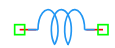

.. _inductor_element:

Inductor
========

The **Inductor** is a fundamental passive component in the DSpice Basic library, used to model electrical inductance within analog circuits.

Symbol
------

The schematic symbol for the Inductor follows the IEEE/ANSI standard representation with a series of loops or coils. 

Description
-----------

An inductor stores electrical energy in a magnetic field created by current flowing through a coiled conductor. In DSpice, the inductor element is defined primarily by its inductance value in Henrys (H). Key characteristics include:

- **Energy Storage:** Stores energy in a magnetic field, following the relationship E = ½ L × I².
- **Frequency Dependent:** Impedance increases with increasing frequency (Z = jωL), making it useful for filtering applications.
- **Passive Component:** Does not require an external power source to function.
- **Transient Behavior:** Current through an inductor cannot change instantaneously, creating time-dependent circuit responses.
- **DC Passing:** Acts as a short circuit at steady-state DC, allowing DC current to pass while opposing AC signals.

The inductor is essential for filtering, energy storage in switching converters, impedance matching, and frequency-selective networks.

Netlist Format
--------------

In the SPICE netlist generated by DSpice, the inductor is represented using the following syntax:

.. code-block:: text

   L<name> <node+> <node-> <value> [IC=<value>]

Where:

- ``L<name>``: Unique identifier starting with 'L' (e.g., L1, L_FILTER, L_CHOKE).
- ``<node+>``: Positive terminal node number or name.
- ``<node->``: Negative terminal node number or name.
- ``<value>``: Inductance value in Henrys. Suffixes like 'm' (milli), 'u' (micro), or 'n' (nano) are supported.
- ``[IC=<value>]``: Optional initial condition specifying the current through the inductor at time t=0 in Amperes.

Example:

.. code-block:: text

   L1 1 2 10m
   L_FILTER in out 100u IC=0.5
   L_CHOKE vcc load 1m

This format ensures full compatibility with ngspice and allows seamless integration into larger circuit netlists.

Advanced Parameters & Symbol Modification
-----------------------------------------

DSpice supports advanced simulation studies through optional parameters that can be added directly to the component symbol. This feature allows users to customize component behavior without altering the global model library.

Adding Initial Conditions
~~~~~~~~~~~~~~~~~~~~~~~~~

To perform transient analysis with specific starting conditions, you can modify the Inductor symbol to expose the ``IC`` parameter:

1. **Open Symbol Editor:** Right-click the Inductor symbol in your schematic and select "Edit Symbol" or access it via the Basic library manager.
2. **Add Parameter:** In the symbol properties panel, add a new parameter field named ``IC``.
3. **Map to Netlist:** Ensure this parameter is mapped to the SPICE ``IC`` attribute in the netlist generation settings.
4. **Save & Use:** Save the modified symbol. When placed in a schematic, you can now enter a specific initial current directly in the component's property dialog.

The current through the inductor during transient analysis starts from:

.. math::

   I_L(0) = I_{IC}

Where :math:`I_{IC}` is the initial condition current specified in the parameter.

Use Cases
~~~~~~~~~

- **Switching Power Supplies:** Storing and transferring energy in buck, boost, and flyback converters.
- **RF Filtering:** Creating LC tank circuits for frequency selection in radio receivers and transmitters.
- **EMI Suppression:** Using choke inductors to block high-frequency noise while allowing DC or low-frequency signals to pass.
- **Energy Storage:** Maintaining current flow during switching transitions in power electronics.