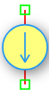

.. _idc_source:

DC Current Source
=================

The **DC Current Source** is a fundamental independent source in the DSpice Sources library. It provides a constant DC current level to the circuit and serves as a bias reference or signal source for analog simulations. It leverages the ngspice ``I`` source model for accurate operating point and transient analysis.

Symbol
------

The schematic symbol for the DC Current Source follows the IEEE/ANSI standard representation.

Description
-----------

A DC Current Source maintains a fixed current flow between its two terminals regardless of the voltage across it (within simulation limits). Key characteristics include:

- **Constant Output:** Provides a steady current level defined by the user, independent of load impedance.
- **Ideal Source:** Has infinite internal parallel resistance by default, ensuring no current leakage.
- **Directional:** Current flows from the positive terminal to the negative terminal as indicated by the arrow in the symbol.
- **Simulation Role:** Essential for biasing transistor circuits, modeling current mirrors, and performing load-pull analysis.

Unlike voltage sources, current sources are less common in basic circuits but are critical in analog IC design, sensor modeling, and advanced simulation scenarios.

Netlist Format
--------------

In the SPICE netlist generated by DSpice, the DC Current Source is represented using the following syntax:

.. code-block:: text

   I<name> <node+> <node-> DC <value> [Rshunt=<value>]

Where:

- ``I<name>``: Unique identifier starting with 'I' (e.g., I1, I_BIAS, I_LOAD).
- ``<node+>``: Positive terminal node number or name (current enters here).
- ``<node->``: Negative terminal node number or name (current exits here).
- ``DC``: Keyword specifying Direct Current mode.
- ``<value>``: Current value in Amperes. Suffixes like 'm' (milli), 'u' (micro), or 'n' (nano) are supported.
- ``[Rshunt=<value>]``: Optional advanced parameter for internal parallel (shunt) resistance in Ohms.

Example:

.. code-block:: text

   I1 1 0 DC 10m
   I_BIAS vdd gnd DC 100u Rshunt=1M
   I_LOAD out 0 DC 1A

This format ensures full compatibility with ngspice and allows seamless integration into larger circuit netlists.

.. note::
   Do NOT use ``R=value`` to specify internal resistance. The correct keyword for current sources is ``Rshunt`` (parallel resistance), unlike voltage sources which use ``Rser`` (series resistance).

Advanced Parameters & Symbol Modification
-----------------------------------------

DSpice supports advanced simulation studies through optional parameters that can be added directly to the component symbol. This feature allows users to customize source behavior without altering the global model library.

Adding Shunt Resistance (Rshunt)
~~~~~~~~~~~~~~~~~~~~~~~~~~~~~~~~

To model a non-ideal current source with finite output impedance, you can modify the DC Current Source symbol to expose the ``Rshunt`` parameter:

1. **Open Symbol Editor:** Right-click the DC Current Source symbol in your schematic and select "Edit Symbol" or access it via the Sources library manager.
2. **Add Parameter:** In the symbol properties panel, add a new parameter field named ``Rshunt``.
3. **Map to Netlist:** Ensure this parameter is mapped to the SPICE ``Rshunt`` attribute in the netlist generation settings.
4. **Save & Use:** Save the modified symbol. When placed in a schematic, you can now enter a specific internal shunt resistance value directly in the component's property dialog.

The effective output current becomes:

.. math::

   I_{out} = I_{source} - \frac{V_{load}}{R_{shunt}}

Where :math:`V_{load}` is the voltage across the load connected to the source.

Use Cases
~~~~~~~~~

- **Transistor Biasing:** Providing stable bias current to BJT or MOSFET amplifier stages.
- **Current Mirror Modeling:** Simulating ideal current mirrors in analog IC design.
- **Sensor Simulation:** Modeling current-output sensors like photodiodes or Hall effect sensors.
- **Load-Pull Analysis:** Testing circuit behavior under varying load conditions with controlled current injection.
