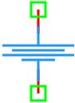

.. _vdc_source:

VDC Source
==========

The **VDC Source** is a fundamental independent voltage source in the DSpice Sources library. It provides a constant DC voltage level to the circuit and serves as the primary power supply or bias reference for analog simulations. It leverages the ngspice ``V`` source model for accurate operating point and transient analysis.

Symbol
------

The schematic symbol for the VDC Source typically follows the standard IEEE/ANSI representation for an independent DC voltage source. It consists of a circle containing polarity indicators (+/-) or a battery-like stack, with two connection terminals marked by green squares indicating the positive and negative nodes.

Description
-----------

A VDC source maintains a fixed potential difference between its two terminals regardless of the current flowing through it (within simulation limits). Key characteristics include:

- **Constant Output:** Provides a steady voltage level defined by the user.
- **Ideal Source:** Has zero internal resistance by default, ensuring no voltage drop under load.
- **Reference Node:** The negative terminal is often connected to ground (Node 0) to establish a circuit reference.
- **Simulation Role:** Essential for establishing the DC Operating Point (.OP) and powering active components like transistors and op-amps.

Netlist Format
--------------

In the SPICE netlist generated by DSpice, the VDC source is represented using the following syntax:

.. code-block:: text

   V<name> <node+> <node-> DC <value>

Where:

- ``V<name>``: Unique identifier starting with 'V' (e.g., V1, VCC, VDD).
- ``<node+>``: Positive terminal node number or name.
- ``<node->``: Negative terminal node number or name.
- ``DC``: Keyword specifying Direct Current mode.
- ``<value>``: Voltage value in Volts. Suffixes like 'm' (milli), 'k' (kilo) are supported.

Example:

.. code-block:: text

   V1 1 0 DC=5
   VCC vdd gnd DC=3.3V

This format ensures full compatibility with ngspice and allows seamless integration into larger circuit netlists.

Advanced Parameters & Symbol Modification
-----------------------------------------

DSpice supports advanced simulation studies through optional parameters that can be added directly to the component symbol. This feature allows users to customize source behavior without altering the global model library.

Adding Series Resistance (RS)
~~~~~~~~~~~~~~~~~~~~~~~~~~~~~

To model a non-ideal voltage source with internal resistance, you can modify the VDC symbol to expose the ``RS`` parameter:

1. **Open Symbol Editor:** Right-click the VDC symbol in your schematic and select "Edit Symbol" or access it via the Sources library manager.
2. **Add Parameter:** In the symbol properties panel, add a new parameter field named ``RS``.
3. **Map to Netlist:** Ensure this parameter is mapped to the SPICE ``Rser`` attribute or appended as a series resistor in the netlist generation settings.
4. **Save & Use:** Save the modified symbol. When placed in a schematic, you can now enter a specific internal resistance value directly in the component's property dialog.

The effective output voltage becomes:

.. math::

   V_{out} = V_{source} - I_{load} \times R_{series}

Where :math:`I_{load}` is the current drawn by the circuit.

In the SPICE netlist generated by DSpice, the VDC source is represented using the following syntax:

.. code-block:: text

   V<name> <node+> <node-> DC <value> [Rser=<value>]

Where:

- ``[Rser=<value>]``: Optional advanced parameter for internal series resistance in Ohms. 
  

.. note::
   Do NOT use ``R=value`` to specify internal resistance. The correct keyword is ``Rser``.
   Alternatively, you can place a separate resistor component in series with an ideal VDC source
   for maximum compatibility across all SPICE variants.

Use Cases
~~~~~~~~~

- **Power Supply Modeling:** Simulating real-world batteries or adapters with internal impedance.
- **Load Regulation Analysis:** Evaluating how output voltage drops under varying load conditions.
- **Transient Protection:** Studying inrush currents when connecting capacitive loads to non-ideal sources.

.. note::
   Modified symbols are stored locally in your project workspace. To share them across projects, export the symbol to the global DSpice library using the "Export to Library" option in the Symbol Editor.