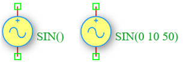

.. _vsin_source:

Sin Voltage Source
==================

The **Sin Voltage Source** is an independent time-varying voltage source in the DSpice Sources library. It generates a sinusoidal voltage waveform and is essential for AC analysis, frequency response testing, and transient simulations of analog circuits. It leverages the ngspice ``SIN`` function within the ``V`` source model.

Symbol
------

The schematic symbol for the Sin Voltage Source follows the IEEE/ANSI standard representation.

Description
-----------

A Sin voltage source produces a time-varying sinusoidal output defined by DC offset, amplitude, frequency, phase, and optional damping characteristics. Key characteristics include:

- **Time-Varying Output:** Generates a continuous sinusoidal voltage waveform for transient analysis.
- **Configurable Parameters:** Supports DC offset, amplitude, frequency, delay, damping factor, and phase shift.
- **AC Analysis Role:** Often used as the stimulus for frequency sweep (AC analysis) to determine circuit bandwidth and filter characteristics.
- **Transient Analysis:** Essential for observing circuit behavior over time with realistic AC voltage signals.

The Sin voltage source is widely used in audio circuits, RF design, filter characterization, and power electronics simulation.

Netlist Format
--------------

In the SPICE netlist generated by DSpice, the Sin voltage source is represented using the following syntax:

.. code-block:: text

   V<name> <node+> <node-> SIN(Voffset Vamplitude freq Td Theta Phase)

Where:

- ``V<name>``: Unique identifier starting with 'V' (e.g., V1, V_SIG, V_AC).
- ``<node+>``: Positive terminal node number or name.
- ``<node->``: Negative terminal node number or name.
- ``SIN(...)``: Keyword specifying sinusoidal waveform with the following parameters:
  - ``Voffset``: DC offset voltage in Volts (the center value of the waveform).
  - ``Vamplitude``: Peak amplitude of the sine wave in Volts.
  - ``freq``: Frequency in Hertz (Hz).
  - ``Td``: Delay time in seconds before the sine wave starts (default: 0).
  - ``Theta``: Damping factor in 1/seconds (default: 0, no damping).
  - ``Phase``: Phase shift in degrees (default: 0).

Examples
~~~~~~~~

**Example 1: Basic 50 Hz AC Voltage Source**

The image above shows a Sin voltage source configured as ``SIN(0 10 50)``:

.. code-block:: text

   V1 1 0 SIN(0 10 50)

This generates:
- **DC Offset:** 0 V (centered around ground)
- **Peak Amplitude:** 10 V (peak-to-peak voltage = 20 V)
- **Frequency:** 50 Hz
- **Period:** T = 1/f = 1/50 = 20 ms

The resulting waveform is:

.. math::

   V(t) = 10 \times \sin(2\pi \times 50 \times t) = 10 \times \sin(100\pi t)

This is commonly used to simulate AC mains power supply in regions with 50 Hz grid frequency.

**Example 2: Biased Audio Signal**

.. code-block:: text

   V_SIG in gnd SIN(2.5 0.5 50k 0 0 90)

This generates:
- **DC Offset:** 2.5 V (biasing the signal to mid-supply)
- **Peak Amplitude:** 0.5 V (small audio signal)
- **Frequency:** 50 kHz
- **Phase Shift:** 90° (cosine waveform)

**Example 3: Damped Voltage Oscillation**

.. code-block:: text

   V_DAMP node1 node2 SIN(0 5 1k 1m 100 0)

This generates:
- **DC Offset:** 0 V
- **Peak Amplitude:** 5 V
- **Frequency:** 1 kHz
- **Delay:** 1 ms (waveform starts after 1 ms)
- **Damping Factor:** 100 (exponentially decaying amplitude)

The voltage waveform is calculated as:

.. math::

   V(t) = V_{offset} + V_{amplitude} \times \sin\left(2\pi \times freq \times (t - T_d) + \frac{\pi \times Phase}{180}\right) \times e^{-(t - T_d) \times \Theta}

for :math:`t \geq T_d`, and :math:`V(t) = V_{offset}` for :math:`t < T_d`.

This format ensures full compatibility with ngspice and allows seamless integration into larger circuit netlists.

Advanced Parameters & Symbol Modification
-----------------------------------------

DSpice supports advanced simulation studies through optional parameters that can be added directly to the component symbol. This feature allows users to customize source behavior without altering the global model library.

Adding Series Resistance (Rser)
~~~~~~~~~~~~~~~~~~~~~~~~~~~~~~~

To model a non-ideal voltage source with internal resistance, you can modify the Vsin symbol to expose the ``Rser`` parameter:

1. **Open Symbol Editor:** Right-click the Sin Voltage Source symbol in your schematic and select "Edit Symbol" or access it via the Sources library manager.
2. **Add Parameter:** In the symbol properties panel, add a new parameter field named ``Rser``.
3. **Map to Netlist:** Ensure this parameter is mapped to the SPICE ``Rser`` attribute in the netlist generation settings.
4. **Save & Use:** Save the modified symbol. When placed in a schematic, you can now enter a specific internal resistance value directly in the component's property dialog.

The effective output voltage becomes:

.. math::

   V_{out} = V_{sin}(t) - I_{load} \times R_{series}

Where :math:`I_{load}` is the current drawn by the circuit.

Use Cases
~~~~~~~~~

- **Filter Characterization:** Sweeping frequency to determine cutoff frequencies and bandwidth of low-pass, high-pass, and band-pass filters.
- **Audio Circuit Testing:** Injecting audio-frequency signals (20 Hz - 20 kHz) to test amplifiers and equalizers.
- **Power Supply Ripple Analysis:** Simulating AC ripple on DC power lines to evaluate filtering effectiveness.
- **RF Design:** Generating carrier signals for modulation and demodulation circuit testing.
- **Transient Response:** Observing how circuits respond to sinusoidal inputs over time, including settling time and overshoot.